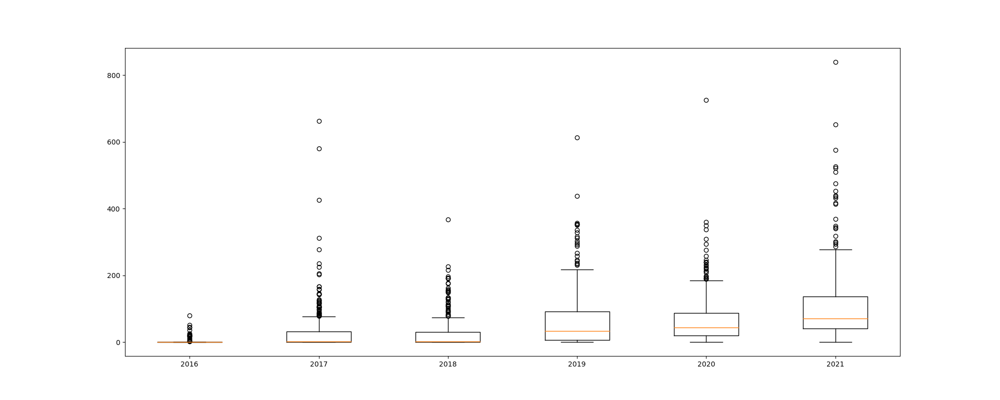
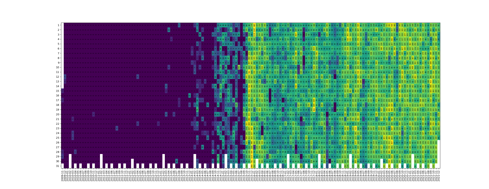

# socialviz
Message visualizator for various social networks.

## Social networks supported
- Facebook Messenger (json)
- Telegram (json)
- Discord (json) [exported with [https://github.com/Tyrrrz/DiscordChatExporter](https://github.com/Tyrrrz/DiscordChatExporter)]

## Usage
Run `python socialviz.py --help` to see the list of command line arguments.

#### Facebook only, for all senders
If the inbox directory is located at `./messages/inbox`, and we want to count messages in the directory named `johnsmith_fO2hnrKt`:
```sh
python socialviz.py --fbpath "./messages/inbox" --fbaccount "johnsmith_fOhnrKt"
```

#### Telegram only, for senders "John" and "Joe"
If the json file is located at `./telegram.json`, and we want to count messages in the chat named `John`:
```sh
python socialviz.py --tgaccount "John" --tgpath "./telegram.json" --tgsender "John" --tgsender "Joe"
```

#### Facebook and Telegram, no attachments, plot only the distribution
```sh
python socialviz.py --no-attachs --fbaccount "johnsmith_fOhnrKt" --tgaccount "John" --display-distribution
```
#### All messages sent by the given accounts, specify figure size and rotate labels
```sh
python socialviz.py --all --fbsender "John Smith" --tgsender "John Smith" --dcsender "johnsmith" --figsize-w 30 --figsize-h 15 --rotate-labels
```

## Plots
The possible types of plots are:
- plot the yearly distribution of daily count of messages


- plot a 2D heatmap containing the daily counts of messages, for each day and year-month


## TODO
- [ ] Handle Skype data
- [ ] Refactor command line arguments with actual subcommands
- [ ] Refactor readers to add one more easily
